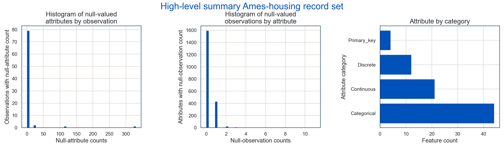

 

# Residential Real-Estate Spot-Market Pricing Model for Ames, IA.

## Executive Summary.
Uncertainty research provides a preliminary capability to identify below-market opportunities. These assets can be acquired quickly on the spot market. A predictive model employs $N$ features to estimate should-cost priceses. 

A hypothetical Real-Estate Investment Trust (REIT) initiated a fund to follow other hedge funds in to the residential real-estate rental market.  The business model is described in [R. Dizember, L. Kuzisto, *WSJ*, July 21, 20176](https://www.wsj.com/articles/meet-your-new-landlord-wall-street-1500647417) and [A. Semiuels, *The Atlantic*, February 13, 2019](https://www.theatlantic.com/technology/archive/2019/02/single-family-landlords-wall-street/582394/), among other places.  

Two aspects of investors' operating model tend to deliver higher profitability than conventional landlords managing single-family homes.  First, the funds buy their properties with cash.  This gives them advantages over housholdes dependendent on financing.  Second, they transfer costs to tenents that are conventionally borne by landlords. Tenants, for example, assume resonsibility for some maintenance cost.

The image below illustrates the concept for operations.  Property buyers on behalf of the fund look listings at below-market prices. The spot-market pricing model provides estimates of the "should-cost" price.  When a below-market price is detected, buyers collect other information and apply it to a total-ownership cost model.  This feeds a decision framework as whether to invest.

The model takes a diverse set of attributes about the characteristics of the property.   Technical details elaborate below.  It explains approximately 90% of the variation in sales price in the Ames, IA market.  It does not handle outliers, exemplified by large-footprint properties in less-expensive neighborhoods.

## Technical Approach.

[Uncertainty Research's](https://www.linkedin.com/company/uncertainty-research-llc/about/) (UR's) delivery method is based on the [Cross-Industry Standard Process – Data Mining](http://4.bp.blogspot.com/-0iGdZDGnLks/VDA-7DKV_NI/AAAAAAAAAEI/IqYBNniTlZA/s1600/141004%2BFormal%2BMethods%2BComparison.png) (CRISP–DM).  Figure 1 provides an overview.  This method has provided the foundations for delivery methods used by many leading technology firms, including IBM.  

UR employs CRISP–DM because it contains more-direct coupling to the business context than some more data-centric methods.  It also provides more-explicit guidance on iterativity, an inescapable part of modeling.  The following subsections summarize its employment in this project.

### Business Understanding

The figure to the below summarizes the concept of operations for our hypothetical REIT.  It seeks to find residential properties that are priced below the market.  Based on a total ownership cost model, it makes a decision whether to purchase the property.  Our REIT becomes an absentee landlord.  It rents the property out to qualified tenants.

 

Here,  we use a prototypical data set from a [well-known kaggle challenge](https://www.kaggle.com/c/house-prices-advanced-regression-techniques).  An actual solution would provide real-time updates from a site such as [Bright MLS Homes](https://www.brightmlshomes.com/) and possible [Zillow](https://www.zillow.com/).  

The work summarized here represents the first step in the `Spot-market pricing model` component of the workflow. We establish here the ability to estimate the *should-cost* price of a home.  We focus at this stage on point estimates.  We extend this in subseqent work to a distribution of expected prices. This allows us to specify a below-market-price threshold, at which the REIT might elect to buy.

The `total ownership-cost model` is a [net-present-value](https://www.investopedia.com/terms/n/npv.asp) (NPV) model of all costs except for the acquisition costs. This is based on a [discounted cash-flow](https://www.investopedia.com/terms/d/dcf.asp) (DCF) analysis of ownership costs such as taxes, maintenance, and insurance.  DCF is a foundational practice in financial accounting (e.g., [[Pratt, 2016]](https://amzn.to/2KkjH3c), [[Libby, *et al*, 2019]](https://amzn.to/2VpcqFD), [[Brealey, *et al*, 2020]](https://amzn.to/3ew0wkV)).  

Finally, an automated decision-making framework would provide REIT asset-portfolio managers with recommendations regarding whether to attempt a purchase of the property. The decision model follows principles from the decision sciences (e.g., [[Kochenderfer, 2015]](https://amzn.to/34RA5BR), [[Skalna, *et al*, 2015]](https://www.springer.com/us/book/9783319264929), [[Howard, 2015]](https://amzn.to/2XS2aYi)).  

For each of the foregoing stages in the purchasing-decision process, we develop distributions of the factors influencing our decision.  These are inferred from the data and fit to a distribution (e.g., [[Keelin, 2016]](https://pubsonline.informs.org/doi/10.1287/deca.2016.0338)).  In sume cases they might be elicited from experts through a process resembling that described by [[Spetzler, 1975]](https://pubsonline.informs.org/doi/abs/10.1287/mnsc.22.3.340).  The overall process is designed using a *probabilistic* approach [[Walsh, 2020]](https://hbr.org/2020/02/develop-a-probabilistic-approach-to-managing-uncertainty).  

### Data Understanding, Perparation.

Our prototypical data set comes from a [well-known kaggle challenge](https://www.kaggle.com/c/house-prices-advanced-regression-techniques).  The figure below depicts summary statistics from the data dictionary, included as an appendix to the end of this report.  We begin with a flat table containing 2,051 records with 83 attributes each. 

 

Most-significantly, we begin with numerous incomplete records. Our data-completeness analysis looks across both observation and attribute dimensions.  We se a small nuber of of records for which many features are missing.  We also see some attributes for which most records lack values.  Our missing-value handling for this exploratory stage is simple.  We discard the attributes for which large proportions of values are missing. 

The analysis also shows the different attribute categories that appear in the data. We have continuous, discrete, and categorical attributes. The discrete attributes are either numeric measurements recorded at integer granularity, or ordinal variables. We do not distinguish for our purposes.  One of the continuous variables `SalesPrice` is our target variable.

 

This amount of attributes is considerable.  We at risk from the *curse of dimensionality* [[Hastie, *et al*, 2009, §2.5]](https://web.stanford.edu/~hastie/Papers/ESLII.pdf). This becomes particularly acute considering our the number of categorical attributes.  When we *dummify* — e.g., [[pandas.get_dummies()]](https://pandas.pydata.org/pandas-docs/stable/reference/api/pandas.get_dummies.html) — the data, the attribute dimensionality could be multiples greater.  

Paring the attribute space provides our response, here. We pair-wise analyze each explanatory variable's relationship with the target variable `SalesPrice`.  This is accomplished via two methods. We consider the pair-wise correlations for continuous and discrete variables. The heatmap column to the right illustrates.  We retain continuous and discrete explanatory variables whose correlation with the response variable exceeds 0.45.  This gives us six continous and five discrete variables.

Our degree-of-influence analysis for categorical variables is somewhat less-direct. We assume that if a categorical variable is a good predictor of a continuous response variable, then the converse should also be true.  So, we construct univariate multinomial logistic-regression models for each categorical variable. We use our `SalesPrice` response variable as the explanatory variable for each such model. We retain categorical variables for which `SalesPrice` predicts their class with accuracy exceeding 0.55. This leaves us with 33 influential categorical variables. After dummifying, we end up with 177 explanatory variables.

Finally, as is always recommended in high-dimensional scenarios, we perform dimensionality analysis of our explanatory-variable set. This  is always advised for multiple reasons.  First, multicollinearity presents difficulties for regression models, in particular (e.g., [[Dielman, 2005, §4.6]](https://amzn.to/2yycLN2), [[Fox, 2008, chap 13]](https://amzn.to/2zhcYot), [[Olive, 2017, §3.8]](https://www.springer.com/us/book/9783319552507)).  Regression models can become unstable in the presence of multicollinearity.  In general, knowing exactly how many explanatory-variable dimensions are actually influential can be useful.

 

The figure to the left depicts results from dimensionality analysis of our 177 explanatory variables. This results from [*singular-value decomposition*](https://en.wikipedia.org/wiki/Singular_value_decomposition) of our explanatory-variable matrix. This tells us how much of the information in our explanatory variables is actually independent (e.g., [[Golub, 1989, §8.3]](https://amzn.to/2VHuzNT), [[Horn, 1985, §7.3.5]](https://amzn.to/3aoWdEP)).  

We find that our 177 explanatory variables are highly dimensionally-domnated. Most of the variance is contained in the first ten dimensions. In fact, only four dimensions contain 99% of the variance. Theoretically, we should be able to reduce our explanatory-variable dimensionality to just a handfull of dimensions and get the same result as using all of them.  We do not attempt this here, however.

### Modeling.

 

We consider a diverse variety of models. The figure to the right extends an important summary from [[Hastie, *et al*, 2009, Table 10.1, p. 351]](https://web.stanford.edu/~hastie/Papers/ESLII.pdf). This table groups the family of mainstream statistical-learning methods into five broad categories. The column headers represent the most-general form of each family of methods.  

For example, *Multi-Attribute Regression Splines* (MARS) represents the most-general form of regression modeling, according to this perspective. Ordinary Least-Squares (OLS) regression is arguably a special case of MARS.

The rows in the table contain points of view on the strengths and weaknesses associated with each of the methods. The original table in  [Hastie, *et al*, 2009]](https://web.stanford.edu/~hastie/Papers/ESLII.pdf) considers nine such factors. The version here has been extended to contain three more. Modeling activities here emphasize predictive power, resistence to overfitting, and conditional probability. 

#### Approaches based on .

This work attempts to span the families in this table.  We however consider slightly different groupings.  The first group consists of methods that linearly transform explanatory-variable observations according to an operation resembling .  This class includes regression modeling, support-vector machines, artificial neural networks (ANNs), and kernel methods. 

The first two explicitly use -type operations in their formulations. ANNs use cascaded  operations of our linear transform.  The 𝜙 functions are rectifier linear unit (RELU) operators. 

The kernel methods — to which the kNN regressor belongs — fit less-well into this grouping.  They employ transforms of the form .  The transform vector 𝝱 however is not uniform across all observations.  The kernel methods *scan* over the explanatory-variable space in a method resembling filtering and pooling in convolutional neural networks [[Haykin, 2009, §4.17]](https://amzn.to/3cvvO9J).

#### Approaches based on recursive binary partitions.

 

*Tree*-based methods comprise our second class of methods.  These are distinct in that they do not involve -type operations.  Alternatively, tree-based methods divide the data using *recursive binary partitioning* ([[Brieman, *et al*, 1984]](https://amzn.to/3ankMSn) [[Hastie, *et al*, 2009, §9.2]](https://web.stanford.edu/~hastie/Papers/ESLII.pdf)). The figure to the left contains an example from [[Brieman, *et al*, 1984, Fig. 2.3]](https://amzn.to/3ankMSn). 

In a regression context — our case of interest — this produces approximations that are piecewise constant.  The partitining is accomplished in a way that maximally distinguishes groups being separated according to some statistical score.  Usually, this is the mean-square error.

Our analysis here considers four variants of tree-based modeling. We first look for the best model for a basic regression tree.  The remaining variants are *ensemble methods*. The first is a *bagging tree*. This simply involves creating a bunch of trees from bootstrap samples of the data. The results of the trees are averaged together.

*Random Forests* extend this smoothing through also randomly selecting from among the feature set [[Hastie, *et al*, 2009, chap 15]](https://web.stanford.edu/~hastie/Papers/ESLII.pdf). Instead of simply bootstrapping our observation set, we also randomly select the features on which partitioning decisions are based. 

*Boosted Trees* "combines the outputs of many 'weak' estimators to produce a powerful 'committee'" [[Hastie, *et al*, 2009, chap 10]](https://web.stanford.edu/~hastie/Papers/ESLII.pdf). We "repeatedly grow shallow trees to the residuals, and hence build up an additive model consisting of the sum of trees" [[Efron, 2016, Chap 17]](https://amzn.to/2KmccsA).  At each stage, weights are applied to each of the training observations.  These weights apply emphasis to the observations for which the greatest error in the previous iterations occured. 

#### Why the distinction between  -based models and recursive binary partition?

 

Recursive binary partitioning is paradigmatically distinct from   modeling in an important aspect. Specifically, they provide a distinct approach to handling of conditional probability.  Conditional probability is a key emphasis of *Probabilistic Graphical Models* (PGMs) (e.g,  [[Pearl, 1988]](https://amzn.to/2VISAnH)   [[Studený, 2005]](https://www.springer.com/us/book/9781852338916) [[Koller, 2009]](https://amzn.to/3aom53p)). The illustration to the right comes from [[Darwiche, 2009, Fig 4.2]](https://amzn.to/3amjVBy).

Tree methods address conditional probability obliquely.  The binary cursive partitioning breaks observations into groups that are conspicuously distinct based on explanatory-variable values. This often proves a powerful approach to phenomenological heterogeneity.  

Alternatively, approaches based on  implicitly assume substantial homogeniety.  Response variables are related to numeric explanatory variables by the same set of slopes in the coefficient vector 𝝱. Distinct categories are handled by translating the intercept.  

Consider for example the instance in which an observation belongs to the  category.  The indicator-function value for that attribute takes unity.  The effective slope — all other variables being equal — becomes , and our estimate .

*Why might this be problematic?*  Association with the  category might mean that we should have a coefficient vector different from 𝝱. Our -based methods only however admit to possibility of a single coefficient vector for all observations.

Tree-based methods get around this by allowing for distinct partitions.  Our response-variable estimates  the piecewise-constant — the set-member average — for all members of a partition.  These estimates however can take on whatever value is appropriate to the partition-set members. It is unconstrained by values of some coefficient 𝝱, which must be shared by all other obsevations

#### Mechanics of modeling.

 

For each model approach approach we employ the [`sklearn.model_selection.GridSearchCV`](https://scikit-learn.org/stable/modules/generated/sklearn.model_selection.GridSearchCV.html) to perform a search over a judiciously-selected hyperparameter space. The table in the [Model Evaluation](https://github.com/hamlett-neil-ur/housing_price_model#model-evaluation) section below lists the hyperprameters searched.  

### Model Evaluation.

 

## Appendix — Data Dictionary.

The data dictionary is an operational component of the code. A template was produced using pandas.DataFrame methods.  The template was exported to a csv file.  This file was manually edited.  A "populated" data dictionary was read back into the python environment.  The contents of the "notes" and "disposition" columns were then used by the logic to handle and prepare the data for modeling.

|  attribute  |non_null_records| type  |distinct_values|                                                                      Notes                                                                       |                          Disposition                          | cat_vars  |
|-------------|---------------:|-------|--------------:|--------------------------------------------------------------------------------------------------------------------------------------------------|---------------------------------------------------------------|-----------|
|1stFlrSF     |            2051|int64  |            915|First Floor square feet. Numeric at integer precision.                                                                                            |Use as provided                                                |Continuous |
|2ndFlrSF     |            2051|int64  |            504|Second floor square feet. Numeric at integer precision.                                                                                           |Use as provided                                                |Continuous |
|3SsnPorch    |            2051|int64  |             22|Three season porch area in square feet. Numeric.                                                                                                  |Use as provided                                                |Continuous |
|Alley        |            2051|object |              3|Alley access to property.  String-categorical.  Category “NA” misinterpreted as Null.                                                             |Use as provided                                                |Categorical|
|BedroomAbvGr |            2051|int64  |              8|Bedrooms above grade (does NOT include basement bedrooms). Discrete numeric.                                                                      |Use as provided                                                |Discrete   |
|BldgType     |            2051|object |              5|Type of dwelling. Categorical string.                                                                                                             |Use as provided                                                |Categorical|
|BsmtCond     |            2050|object |              7|Evaluates the general condition of the basement. String categorical. NA (⇒ “No Basement”) misinterpreted as NULL; empty values also present.      |Assign null values to “NA”                                     |Categorical|
|BsmtExposure |            2047|object |              6|Refers to walkout or garden level walls. String categorical. NA (⇒ “No Basement”) misinterpreted as NULL; empty values also present.              |Assign null values to “NA”                                     |Categorical|
|BsmtFullBath |            2049|float64|              6|Basement full bathrooms. Discrete numeric count. Missing values ≟ 0.                                                                              |Assign null values to 0                                        |Discrete   |
|BsmtHalfBath |            2049|float64|              5|Basement half bathrooms. Discrete numeric count.  Missing values ≟ 0.                                                                             |Assign null values to 0                                        |Discrete   |
|BsmtQual     |            2050|object |              7| Evaluates the height of the basement. String categorical. NA (⇒ “No Basement”) misinterpreted as NULL; empty values also present.                |Assign null values to “NA”                                     |Categorical|
|BsmtUnfSF    |            2050|float64|            968|Unfinished square feet of basement area. Numeric.                                                                                                 |Assign null values to 0                                        |Continuous |
|BsmtFinSF1   |            2050|float64|            822|Type 1 finished square feet. Numeric.                                                                                                             |Assign null values to 0                                        |Continuous |
|BsmtFinSF2   |            2050|float64|            206|Type 2 finished square feet. Numeric.                                                                                                             |Assign null values to 0                                        |Continuous |
|BsmtFinType1 |            2050|object |              8|Rating of basement finished area. String categorical.  NA (⇒ “No Basement”) misinterpreted as NULL; empty values also present.                    |Assign null values to “NA”                                     |Categorical|
|BsmtFinType2 |            2049|object |              8|Rating of basement finished area (if multiple types). String categorical.  NA (⇒ “No Basement”) misinterpreted as NULL; empty values also present.|Assign null values to “NA”                                     |Categorical|
|CentralAir   |            2051|object |              2|Central air conditioning. String binary categorical.                                                                                              |Use as provided                                                |Categorical|
|Condition1   |            2051|object |              9|Proximity to various conditions, transportation services, in particular. Nine categorical strings.                                                |Use as provided                                                |Categorical|
|Condition2   |            2051|object |              8|Proximity to various conditions (if more than one is present). Eight categorical strings.                                                         |Use as provided                                                |Categorical|
|Selldate     |            2051|Integer|             55|Date of sale.  Concatenation of Yr_sold, Mo_Sold.                                                                                                 |Use as provided                                                |Primary_key|
|Electrical   |            2051|object |              5|Electrical system. String categorical.                                                                                                            |Use as provided                                                |Categorical|
|EnclosedPorch|            2051|int64  |            159|Enclosed porch area in square feet. Numeric.                                                                                                      |Use as provided                                                |Continuous |
|ExterCond    |            2051|object |              5|Evaluates the present condition of the material on the exterior. String categorical.                                                              |Use as provided                                                |Categorical|
|ExterQual    |            2051|object |              4|Evaluates the quality of the material on the exterior. String categorical.                                                                        |Use as provided                                                |Categorical|
|Exterior1st  |            2051|object |             15|Exterior covering on house. String Categorical.                                                                                                   |Use as provided                                                |Categorical|
|Exterior2nd  |            2051|object |             15|Exterior covering on house (if more than one material). String Categorical.                                                                       |Use as provided                                                |Categorical|
|Fence        |            2051|object |              5|Fence quality. String categorical. NA (⇒ “No Fence”) misinterpreted as NULL.                                                                      |Use as provided                                                |Categorical|
|FireplaceQu  |            2051|object |              6|Fireplace quality. String categorical.  NA (⇒ “No Fireplace”) misinterpreted as NULL.                                                             |Use as provided                                                |Categorical|
|Fireplaces   |            2051|int64  |              5|Number of fireplace. Discrete numeric count.                                                                                                      |Use as provided                                                |Discrete   |
|Foundation   |            2051|object |              6|Type of foundation. String categorical.                                                                                                           |Use as provided                                                |Categorical|
|FullBath     |            2051|int64  |              5|Full bathrooms above grade. Discrete numeric count.                                                                                               |Use as provided                                                |Discrete   |
|Functional   |            2051|object |              8|Home functionality (Assume typical unless deductions are warranted). String categorical.                                                          |Use as provided                                                |Categorical|
|GarageArea   |            2050|float64|            515|Size of garage in square feet. Continuous numeric at integer precision. Empty for Garage_Type = “NA”.                                             |Assign null values to 0                                        |Continuous |
|GarageCars   |            2050|float64|              7|Size of garage in car capacity. Discrete numeric count. Missing values ≟ 0.                                                                       |Use as provided                                                |Discrete   |
|GarageCond   |            2050|object |              7|Garage condition. String categorical.  NA (⇒ “No Garage”) misinterpreted as NULL; Missing value for non-NA garage.                                |Discard records:  null-valued  for non-NA garage               |Categorical|
|GarageFinish |            2050|object |              5|Interior finish of the garage. String categorical.  NA (⇒ “No Garage”) misinterpreted as NULL.                                                    |Use as provided                                                |Categorical|
|GarageQual   |            2050|object |              7|Garage quality. String categorical.    NA (⇒ “No Garage”) misinterpreted as NULL; Missing value for non-NA garage.                                |Discard records:  null-valued records for non-NA garage        |Categorical|
|GarageType   |            2051|object |              7|Garage location. String categorical.   NA (⇒ “No Garage”) misinterpreted as NULL.                                                                 |Use as provided                                                |Categorical|
|GarageYrBlt  |            1937|float64|            214|Year garage was built. Numeric at discrete-year resolution. Empty for Garage_Type = “NA”.                                                         |Discard attribute. Highly correlated with Year_built attribute.|Discrete   |
|GrLivArea    |            2051|int64  |           1053|Above grade (ground) living area square feet. Numeric at integer precision.                                                                       |Use as provided                                                |Continuous |
|HalfBath     |            2051|int64  |              3|Half baths above grade. Discrete numeric count.                                                                                                   |Use as provided                                                |Discrete   |
|Heating      |            2051|object |              5|Type of heating. String categorical.                                                                                                              |Use as provided                                                |Categorical|
|HeatingQC    |            2051|object |              5|Type of heating. String categorical.                                                                                                              |Use as provided                                                |Categorical|
|HouseStyle   |            2051|object |              8|Style of dwelling. Categorical string                                                                                                             |Use as provided                                                |Categorical|
|Id           |            2051|int64  |           2051|Unique ID. Integer                                                                                                                                |Use as provided                                                |Primary_key|
|KitchenAbvGr |            2051|int64  |              4|Kitchens above grade. Discrete numeric count.                                                                                                     |Use as provided                                                |Discrete   |
|KitchenQual  |            2051|object |              4|Kitchen quality. String categorical.                                                                                                              |Use as provided                                                |Categorical|
|LandContour  |            2051|object |              4|Flatness of the property. Four string Categorical                                                                                                 |Use as provided                                                |Categorical|
|LandSlope    |            2051|object |              3|Slope of property. Three categorical strings.                                                                                                     |Use as provided                                                |Categorical|
|LotArea      |            2051|int64  |           1476|Lot size in square feet. Numeric continuous at integer precision.                                                                                 |Use as provided                                                |Continuous |
|LotConfig    |            2051|object |              5|Lot configuration. Five string categorical.                                                                                                       |Use as provided                                                |Categorical|
|LotFrontage  |            1721|float64|            448|Linear feet of street connected to property. Numeric continuous No obvious relationship to other attributes.                                      |Discard attribute.                                             |Continuous |
|LotShape     |            2051|object |              4|General shape of property. Four string Categorical.                                                                                               |Use as provided                                                |Categorical|
|LowQualFinSF |            2051|int64  |             31|Low quality finished square feet (all floors). Numeric at integer precision.                                                                      |Use as provided                                                |Continuous |
|MasVnrArea   |            2029|float64|            395|Masonry veneer area in square feet.  Some empty values. Numeric continuous.  Empty ≟ 0.                                                           |Discard records:  null-valued records.                         |Continuous |
|MasVnrType   |            2029|object |              5|Masonry veneer type. Five categorical values. Some empty values.  Empty ≟ “None”                                                                  |Discard records:  null-valued records.                         |Categorical|
|MiscFeature  |            2051|object |              6|Miscellaneous feature not covered in other categories. String categorical.  NA (⇒ “None”) misinterpreted as NULL.                                 |Use as provided                                                |Categorical|
|MiscVal      |            2051|int64  |             28|Value of miscellaneous feature. Numeric.                                                                                                          |Use as provided                                                |Continuous |
|MSSubClass   |            2051|int64  |             16|Identifies the type of dwelling involved in the sale. Numeric categorical (non-ordinal). Sixteen categories, all of which represented in data.    |Use as provided                                                |Categorical|
|MSZoning     |            2051|object |              7|Identifies the general zoning classification of the sale. String categorical. Seven of eight possible values represented.                         |Use as provided                                                |Categorical|
|Neighborhood |            2051|object |             28|Physical locations within Ames city limits. 28 categorical strings.                                                                               |Use as provided                                                |Categorical|
|OpenPorchSF  |            2051|int64  |            223|Open porch area in square feet. Numeric.                                                                                                          |Use as provided                                                |Continuous |
|OverallCond  |            2051|int64  |              9|Rates the overall condition of the house. Categorical Integer.                                                                                    |Use as provided                                                |Categorical|
|OverallQual  |            2051|int64  |             10|Rates the overall material and finish of the house. Categorical Integer.                                                                          |Use as provided                                                |Categorical|
|PavedDrive   |            2051|object |              3|Paved driveway. String categorical.                                                                                                               |Use as provided                                                |Categorical|
|PID          |            2051|int64  |           2051|Unique ID. Integer.                                                                                                                               |Use as provided                                                |Primary_key|
|PoolArea     |            2051|int64  |             10|Pool area in square feet. Numeric.                                                                                                                |Use as provided                                                |Continuous |
|PoolQC       |            2051|object |              5|Pool quality. String categorical.   NA (⇒ “No Pool”) misinterpreted as NULL; Missing value for non-NA garage.                                     |Use as provided                                                |Categorical|
|RoofMatl     |            2051|object |              6|Roof material. String Categorical.                                                                                                                |Use as provided                                                |Categorical|
|RoofStyle    |            2051|object |              6|Type of roof. String Categorical.                                                                                                                 |Use as provided                                                |Categorical|
|SalePrice    |            2051|object |              9|Type of sale. String categorical.                                                                                                                 |Use as provided                                                |Categorical|
|SaleType     |            2051|int64  |            828|Type of sale. Target Variable.                                                                                                                    |Use as provided                                                |           |
|ScreenPorch  |            2051|int64  |            100|Screen porch area in square feet. Numeric.                                                                                                        |Use as provided                                                |Continuous |
|Street       |            2051|object |              2|Type of road access to property. Two-string categorical                                                                                           |Use as provided                                                |Categorical|
|TotalBsmtSF  |            2050|float64|            893|Total square feet of basement area. Numeric                                                                                                       |Assign null values to 0                                        |Continuous |
|TotRmsAbvGrd |            2051|int64  |             14|Total rooms above grade (does not include bathrooms). Discrete numeric count.                                                                     |Use as provided                                                |Discrete   |
|Utilities    |            2051|object |              3|Type of utilities available. Four string categorical, of which three are present. No 'ELO' isntances                                              |Use as provided                                                |Categorical|
|WoodDeckSF   |            2051|int64  |            322|Wood deck area in square feet. Numeric.                                                                                                           |Use as provided                                                |Continuous |
|YearBuilt    |            2051|int64  |            113|Original construction date. Numeric measurement at integer precision.                                                                             |Use as provided                                                |Continuous |
|YearRemodAdd |            2051|int64  |             61|Remodel date (same as construction date if no remodeling or additions).  Numeric measurement at integer precision.                                |Use as provided                                                |Continuous |

___
